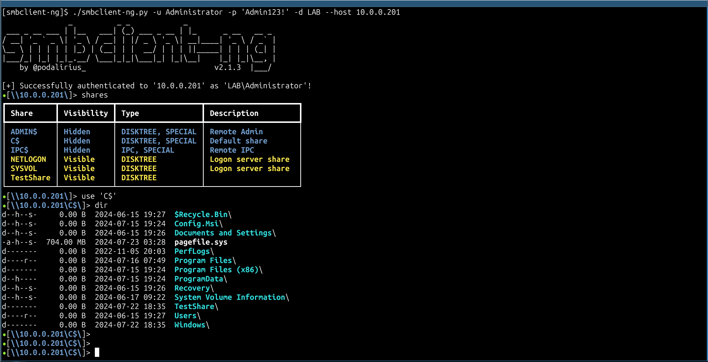

<p align="center">
    smbclient-ng, a fast and user friendly way to interact with SMB shares.
    <br>
    
    
    <a href="https://twitter.com/intent/follow?screen_name=podalirius_" title="Follow"></a>
    <a href="https://www.youtube.com/c/Podalirius_?sub_confirmation=1" title="Subscribe"></a>
    <br>
</p>

## Features

- [x] `acls`: List ACLs of files and folders in cwd. Syntax: `acls`
- [x] `bat`: Pretty prints the contents of a file. Syntax: `bat <file>`
- [x] `cat`: Get the contents of a file. Syntax: `cat <file>`
- [x] `cd`: Change the current working directory. Syntax: `cd <directory>`
- [x] `close`: Closes the SMB connection to the remote machine. Syntax: `close`
- [x] `connect`: Connect to the remote machine (useful if connection timed out). Syntax: `connect`
- [x] `dir`: List the contents of the current working directory. Syntax: `dir`
- [x] `exit`: Exits the smbclient-ng script. Syntax: `exit`
- [x] `get`: Get a remote file. Syntax: `get [-r] <directory or file>`
- [x] `help`: Displays this help message. Syntax: `help`
- [x] `head`: Get the first n lines of a remote file. Syntax: `head <file>`
- [x] `history`: Displays the command history. Syntax: `history`
- [x] `info`: Get information about the server and or the share. Syntax: `info [server|share]`
- [x] `lbat`: Pretty prints the contents of a local file. Syntax: `lbat <file>`
- [x] `lcat`: Print the contents of a local file. Syntax: `lcat <file>`
- [x] `lcd`: Changes the current local directory. Syntax: `lcd <directory>`
- [x] `lcp`: Create a copy of a local file. Syntax: `lcp <srcfile> <dstfile>`
- [x] `lls`: Lists the contents of the current local directory. Syntax: `lls`
- [x] `lmkdir`: Creates a new local directory. Syntax: `lmkdir <directory>`
- [x] `lpwd`: Shows the current local directory. Syntax: `lpwd`
- [x] `lrename`: Renames a local file. Syntax: `lrename <oldfilename> <newfilename>`
- [x] `lrm`: Removes a local file. Syntax: `lrm <file>`
- [x] `lrmdir`: Removes a local directory. Syntax: `lrmdir <directory>`
- [x] `ls`: List the contents of the current remote working directory. Syntax: `ls`
- [x] `ltree`: Displays a tree view of the local directories. Syntax: `ltree [directory]`
- [x] `metadata`: Get metadata about a file or directory. Syntax: `metadata <file|directory>`
- [x] `mkdir`: Creates a new remote directory. Syntax: `mkdir <directory>`
- [x] `module`: Loads a specific module for additional functionalities. Syntax: `module <name>`
- [x] `mount`: Creates a mount point of the remote share on the local machine. Syntax: `mount <remote_path> <local_mountpoint>`
- [x] `put`: Put a local file or directory in a remote directory. Syntax: `put [-r] <directory or file>`
- [x] `reconnect`: Reconnect to the remote machine (useful if connection timed out). Syntax: `reconnect`
- [x] `reset`: Reset the TTY output, useful if it was broken after printing a binary file on stdout. Syntax: `reset`
- [x] `rm`: Removes a remote file. Syntax: `rm <file>`
- [x] `rmdir`: Removes a remote directory. Syntax: `rmdir <directory>`
- [x] `sessions`: Manage the SMB sessions. Syntax: `sessions [interact|create|delete|execute|list]`
- [x] `shares`: Lists the SMB shares served by the remote machine. Syntax: `shares`
- [x] `sizeof`: Recursively compute the size of a folder. Syntax: `sizeof [directory|file]`
- [x] `tail`: Get the last n lines of a remote file. Syntax: `tail <file>`
- [x] `tree`: Displays a tree view of the remote directories. Syntax: `tree [directory]`
- [x] `umount`: Removes a mount point of the remote share on the local machine. Syntax: `umount <local_mount_point>`
- [x] `use`: Use a SMB share. Syntax: `use <sharename>`


## Install

To install `smbclient-ng`, you can use `pip`, `pip3` or `pipx`. You can run any of the following command in your terminal to install [smbclient-ng](https://github.com/p0dalirius/smbclient-ng) :

+ With `pip`:
    ```
    python3 -m pip install smbclientng
    ```

+ With `pip3`:
    ```
    pip3 install smbclientng
    ```
    
+ With `pipx`:
    ```
    pipx install smbclientng
    ```

## Demonstration



## Usage

```
$ ./smbclient-ng.py 
               _          _ _            _                    
 ___ _ __ ___ | |__   ___| (_) ___ _ __ | |_      _ __   __ _ 
/ __| '_ ` _ \| '_ \ / __| | |/ _ \ '_ \| __|____| '_ \ / _` |
\__ \ | | | | | |_) | (__| | |  __/ | | | ||_____| | | | (_| |
|___/_| |_| |_|_.__/ \___|_|_|\___|_| |_|\__|    |_| |_|\__, |
    by @podalirius_                             v2.1.6  |___/  
    
usage: smbclient-ng.py [-h] [--debug] [--no-colors] [-S startup_script] [-N] [-L LOGFILE] [--timeout TIMEOUT]
                       [--advertised-name ADVERTISED_NAME] --host HOST [--port PORT] [--kdcHost FQDN KDC] [-d DOMAIN] [-u USER]
                       [--no-pass | -p [PASSWORD] | -H [LMHASH:]NTHASH | --aes-key hex key] [-k]

smbclient-ng, a fast and user friendly way to interact with SMB shares.

options:
  -h, --help            show this help message and exit
  --debug               Debug mode.
  --no-colors           No colors mode.
  -S startup_script, --startup-script startup_script
                        File containing the list of commands to be typed at start of the console.
  -N, --not-interactive
                        Non interactive mode.
  -L LOGFILE, --logfile LOGFILE
                        File to write logs to.
  --timeout TIMEOUT     Timeout in seconds for SMB connections (default: 3)
  --advertised-name ADVERTISED_NAME
                        Advertised name of your machine to the SMB client.

Target:
  --host HOST           IP address or hostname of the SMB Server to connect to.
  --port PORT           Port of the SMB Server to connect to. (default: 445)

Authentication & connection:
  --kdcHost FQDN KDC    FQDN of KDC for Kerberos.
  -d DOMAIN, --domain DOMAIN
                        (FQDN) domain to authenticate to.
  -u USER, --user USER  User to authenticate with.

  --no-pass             Don't ask for password (useful for -k).
  -p [PASSWORD], --password [PASSWORD]
                        Password to authenticate with.
  -H [LMHASH:]NTHASH, --hashes [LMHASH:]NTHASH
                        NT/LM hashes, format is LMhash:NThash.
  --aes-key hex key     AES key to use for Kerberos Authentication (128 or 256 bits).
  -k, --kerberos        Use Kerberos authentication. Grabs credentials from .ccache file (KRB5CCNAME) based on target parameters. If
                        valid credentials cannot be found, it will use the ones specified in the command line.
```

## Quick start commands

 + Connect to a remote SMB server:
    ```
    smbclient-ng -d "LAB" -u "Administrator" -p 'Admin123!' --host "10.0.0.201"
    ```

## Contributing

Pull requests are welcome. Feel free to open an issue if you want to add other features.
